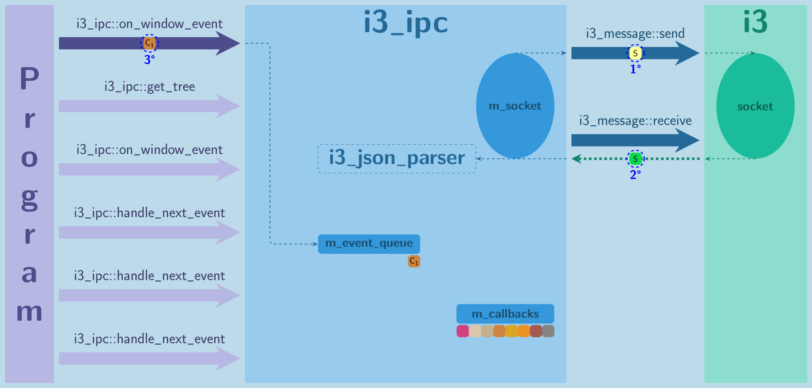
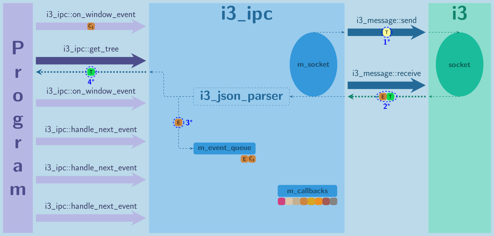
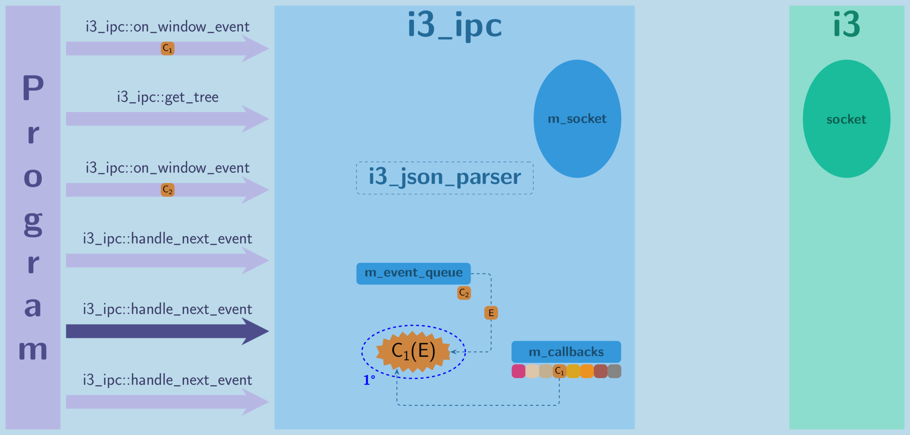
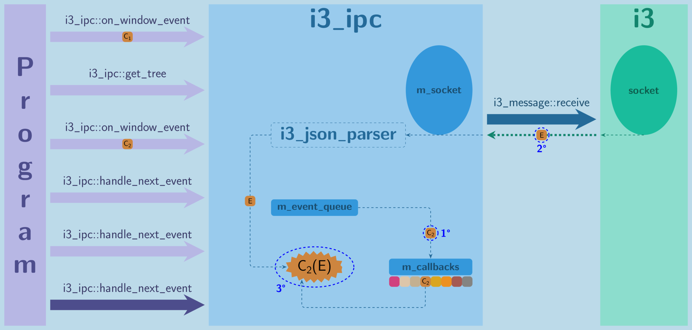

# i3-ipc++ #

C++ library that implements the [i3 IPC protocol](https://i3wm.org/docs/ipc.html).

## Index ##

* [Introduction](#introduction)
* [Goals](#goals)
* [Prerequisites](#prerequisites)
* [Installation](#installation)
* [Usage](#usage)
  * [Write example code](#write-example-code)
    * [Maximize the currently focused window](#example-1)
    * [Get title of the focused window](#example-2)
    * [When new window is created, write its title](#example-3)
    * [More examples](#more-examples)
  * [Compilation](#compilation)
  * [Linking](#linking)
    * [Static linking](#static-linking)
    * [Dynamic linking](#dynamic-linking)
  * [Running](#running)
* [Public API](#public-api)
  * [Headers](#headers)
  * [Classes](#classes)
  * [Namespaces](#namespaces)
* [Internals](#internals)
  * [Overview](#overview)
  * [Simulation](#simulation)
  * [Code structure](#code-structure)
* [Compatibility](#compatibility)
* [TODO](#todo)
* [License](#license)

## Introduction ##

[i3 window manager](https://i3wm.org) defines the [IPC](https://en.wikipedia.org/wiki/Inter-process_communication)
protocol which can be used by other processes to directly talk to **i3**.  
This is very useful because it allows external projects to interact closely with **i3** quite easily.  
Currently, **i3** allows other processes to:
  1) Send predefined commands which **i3** can execute. (Example: [Maximize the currently focused window](#example-1).)
  2) Request some data that **i3** has. (Example: [Get title of the focused window](#example-2).)
  3) Get notifications about events that are happening in **i3**. (Example: [When new window is created, write its title](#example-3).)

**i3-ipc++** allows C++ projects to easily use what **i3** offers without the need to go into details of the implementation.

## Goals ##

Here is a list of goals in decreasing order of importance:

  1) **Completeness** - Support every feature that **i3** offers.
  2) **Documentation** - Thoroughly document everything implemented.
  3) **Stability** - Try to handle/propagate most errors to avoid the crash.
  4) **Convenience** - Strive to give the simplest API to the user.
  5) **Code readibility** - Avoid using efficient *hacks* at the cost of code readability.
  6) **Performance** - Try to be as performant as possible without hurting other goals.

## Prerequisites ##

* [i3](https://github.com/i3/i3)
* [RapidJSON](https://github.com/Tencent/rapidjson/)
* Modern C++17 compiler.
* CMake (optional)

## Installation ##

### Install via `make` (official)

```sh
./configure --help    # See how you can configure build system.
./configure [options] # Configure build for your needs.
make                  # Build library in configured way.
# make install        # Optionally install the library in configured way.
```

### Install via `cmake` (unofficial - thanks @rbrugo)

```sh
mkdir build
cd build
cmake [-Doption...] ..             # Configure build
cmake --build .                    # Build library in configured way
# cmake --build . --target install # Optionally install the library
```
Available options are `build_static`, `build_dynamic` and `build_examples`;
you can choose the install prefix with `-DCMAKE_INSTALL_PREFIX=<path>`.
You can later import this library in your CMake project with `find_package`:
```
find_package(i3-ipc++ REQUIRED)
```
and link your library against the required build:
```
target_link_libraries(<your_target> <PUBLIC|PRIVATE|INTERFACE> i3-ipc++::i3-ipc++[-shared|-static])
```

## Usage ##

### Write example code ###

----------

##### Example 1 #####

* Maximize the currently focused window.

*example.cpp*

```cpp
// Include the i3_ipc class which does all IPC communication with i3 for you.
#include "i3_ipc.hpp"

int main()
{
    // Create IPC object and connect it to running i3 process.
    i3_ipc i3;

    // Tell i3 to maximize currently focused window.
    i3.execute_commands("fullscreen");

    return 0;
}
```

----------

##### Example 2 #####

* Get title of the focused window.

*example.cpp*

```cpp
// Include the i3_ipc class which does all IPC communication with i3 for you.
#include "i3_ipc.hpp"

// Include containers to store data from i3.
#include "i3_containers.hpp"

#include <cstdint>
#include <iostream>
#include <optional>

// Find the focused node in i3's tree of containers.
std::optional<i3_containers::node> find_focused_node(const i3_containers::node& a_root)
{
    // If current node is focused, the search is finished.
    if (a_root.is_focused)
    {
        return a_root;
    }

    // If current node doesn't have the focus list order, it means that none of its children nodes are focused.
    if (a_root.focus.empty())
    {
        return std::nullopt;
    }

    // Recursively traverse the first child(either tilling or floating) node in the focus list order.
    const std::uint64_t ID_of_focused_child = a_root.focus.front();
    for (const auto& node : a_root.nodes)
    {
        if (node.id == ID_of_focused_child)
        {
            return find_focused_node(node);
        }
    }
    for (const auto& node : a_root.floating_nodes)
    {
        if (node.id == ID_of_focused_child)
        {
            return find_focused_node(node);
        }
    }

    // This should never happen!!!
    // If node has the focus list order, it should also have the children nodes with IDs from the focus list order.
    return std::nullopt;
}

int main()
{
    // Create IPC object and connect it to running i3 process.
    i3_ipc i3;

    // Get internal node tree from i3.
    const i3_containers::node tree = i3.get_tree();

    // Try to find the focused node in i3's tree of containers.
    const std::optional<i3_containers::node> focused_node = find_focused_node(tree);

    // Check if focused node is found.
    if (!focused_node)
    {
        std::cout << "Couldn't find focused node!" << std::endl;
        return 0;
    }

    std::cout << "Title of the focused window: " << focused_node->name.value_or("Unknown to i3") << std::endl;

    return 0;
}
```

----------

##### Example 3 #####

* When new window is created, write its title.

*example.cpp*

```cpp
// Include the i3_ipc class which does all IPC communication with i3 for you.
#include "i3_ipc.hpp"

// Include containers to store data from i3.
#include "i3_containers.hpp"

#include <string>
#include <optional>
#include <iostream>

// Callback function which will be called on i3's window event.
void window_callback(const i3_containers::window_event& a_window_event)
{
    // Only when new window is created, write it's title.
    if (a_window_event.change == i3_containers::window_change::create)
    {
        // i3 gave us container which will contain this new window.
        // Its name should be same as the title of the window.
        const std::optional<std::string>& title = a_window_event.container.name;

        // Write the title of the newly created window.
        std::cout << "New window's title is: " << title.value_or("Unknown to i3.") << std::endl;
    }
}

int main()
{
    // Create IPC object and connect it to running i3 process.
    i3_ipc i3;

    // Subscribe to i3's window event and store callback function to react on it.
    i3.on_window_event(window_callback);

    // Wait and handle all subscribed events.
    // In our case, we only subscribed to window event.
    while (true)
    {
        i3.handle_next_event();
    }

    return 0;
}
```

#### More examples ####

This project contains several examples in the [examples](examples) directory.  
Most examples are simple and just show you how to use the library to get something done.  
There are few of them that are focusing on proper exception handling with this library, be sure not to miss them.

### Compilation ###

```sh
g++ -c -std=c++17 -I[path_to_include_dir] example.cpp
```

If you [installed](#installation) headers from **i3-ipc++** in place that compiler will search, you can omit `-I[path_to_include_dir]`.  
Otherwise, `[path_to_include_dir]` should point to where they are installed (or *include* directory in this project).

### Linking ###

Depending on your [installation](#installation), you should have either static, dynamic or both versions of the library built.

#### Static linking ####

For static linkage, you should use:
```sh
g++ -static -L[path_to_static_lib] example.o -o example -li3-ipc++
```

If you [installed](#installation) **libi3-ipc++.a** in place that compiler will search, you can omit `-L[path_to_static_lib]`.  
Otherwise, `[path_to_static_lib]` should point to where it is installed (or *build/lib/static* directory in this project).

#### Dynamic linking ####

For dynamic linkage, you should use:
```sh
g++ -L[path_to_dynamic_lib] -Wl,-rpath,[path_to_dynamic_lib] example.o -o example -li3-ipc++
```

If you [installed](#installation) **libi3-ipc++.so** in place that compiler will search, you can omit `-L[path_to_dynamic_lib]`  
and `-Wl,-rpath,[path_to_dynamic_lib]`.  
Otherwise, `[path_to_dynamic_lib]` should point to where it is installed (or *build/lib/dynamic* directory in this project).  
**Note** that when you run dynamically linked *example*, **libi3-ipc++.so** must exist in `[path_to_dynamic_lib]`.

### Running ###

If you did everything right, you should be able to run `example`.
```sh
./example
```

## Public API ##

### Headers ###

* [i3_ipc.hpp](include/i3_ipc.hpp): Defines [i3_ipc](#i3_ipc) class.
* [i3_containers.hpp](include/i3_containers.hpp): Defines [i3_containers](#i3_containers) namespace.
* [i3_ipc_exception.hpp](include/i3_ipc_exception.hpp): Defines [i3_ipc_exception](#i3_ipc_exception) class.
* [i3_ipc_unsupported.hpp](include/i3_ipc_unsupported.hpp): Defines [i3_ipc_unsupported](#i3_ipc_unsupported) class.
* [i3_ipc_bad_message.hpp](include/i3_ipc_bad_message.hpp): Defines [i3_ipc_bad_message](#i3_ipc_bad_message) class.
* [i3_ipc_invalid_argument.hpp](include/i3_ipc_invalid_argument.hpp): Defines [i3_ipc_invalid_argument](#i3_ipc_invalid_argument) class.

### Classes ###

* #### i3_ipc ####
  This class is used for over-socket communication with running **i3** window manager.

* #### i3_ipc_exception ####
  Exception class, derived from [std::exception](https://en.cppreference.com/w/cpp/error/exception), used only for internal problems of **i3-ipc++** library.

* #### i3_ipc_unsupported ####
  Exception class, derived from [i3_ipc_exception](#i3_ipc_exception), used when some property has the value unknown to **i3-ipc++**.

* #### i3_ipc_bad_message ####
  Exception class derived from [i3_ipc_exception](#i3_ipc_exception), used when **i3-ipc++** receives invalid message from **i3**.

* #### i3_ipc_invalid_argument ####
  Exception class, derived from [i3_ipc_exception](#i3_ipc_exception), used when user provides bad arguments to the **i3-ipc++**.

### Namespaces ###

* #### i3_containers ####
  Defines containers for all info that **i3** can provide.

## Internals ##

### Overview ###

Best way to explain the internal work of the **i3-ipc++** library is on simple example.

```cpp
// Include the i3_ipc class which does all IPC communication with i3 for you.
#include "i3_ipc.hpp"

// Include containers to store data from i3.
#include "i3_containers.hpp"

int main()
{
    // Create IPC object and connect it to running i3 process.
    i3_ipc i3;

    // Subscribe to i3's window event with callback function c1.
    auto c1 = [](const i3_containers::window_event& e) {(void)e;};
    i3.on_window_event(c1); // #1

    // Window event happened now.

    // Request some data from i3.
    auto node_tree = i3.get_tree(); // #2

    // Another window event happened now.

    // Subscribe to i3's window event with NEW callback function c2.
    auto c2 = [](const i3_containers::window_event& e) {(void)e;};
    i3.on_window_event(c2); // #3

    // Handle received event.
    i3.handle_next_event(); // #4

    // Handle received event.
    i3.handle_next_event(); // #5

    // Another window event happened now.

    // Handle received event.
    i3.handle_next_event(); // #6

    return 0;
}
```

* #1
  
  1&deg; - `i3_ipc` will send subscription request for window events to **i3**.  
  2&deg; - `i3_ipc` will read and parse **i3**'s response to know if subscription succeeded.  
  3&deg; - If subscription succeeded, `i3_ipc` will store given callback(**c1**) in `m_event_queue`.  
  **Note that callback c1 is placed in `m_event_queue` and not directly in `m_callbacks`.**  
  By doing it this way, `i3_ipc` is able to respect the chronological order of events and set callbacks.

* #2
  
  1&deg; - `i3_ipc` will send request for **i3**'s internal node structure to **i3**.  
  2&deg; - `i3_ipc` will read and parse **i3**'s responses until it gets requested data or status that it failed.  
  3&deg; - Since window event happened, `i3_ipc` will parse it and place it in the `m_event_queue` for later handling.  
  4&deg; - Now that `i3_ipc` successfully received and parsed requested data, it will return it to the caller.  

* #3
  
  1&deg; - `i3_ipc` will send subscription request for window events to **i3**.  
  2&deg; - `i3_ipc` will read and parse **i3**'s responses until it gets response for sent subscription.  
  3&deg; - Since window event happened, `i3_ipc` will parse it and place it in the `m_event_queue` for later handling.  
  4&deg; - If subscription succeeded, `i3_ipc` will store given callback(**c2**) in `m_event_queue`.  
  **Note that subscription request is again sent to i3 even if we are already subscribed to that event.**  
  By requesting it again, `i3_ipc` is able to respect the chronological order of events and set callbacks.  

* #4
  
  `i3_ipc` will go through `m_event_queue` until it handles **first event**. If queue has no events, it will read one from socket.  
  1&deg; - First element in `m_event_queue` is callback(**c1**), therefore, `i3_ipc` will set it in `m_callbacks` and continue.  
  2&deg; - Next element in `m_event_queue` is window event and `i3_ipc` will call appropriate callback(**c1**) with it.  

* #5
  
  `i3_ipc` will go through `m_event_queue` until it handles **first event**. If queue has no events, it will read one from socket.  
  1&deg; - First element in `m_event_queue` is window event and `i3_ipc` will call appropriate callback(**c1**) with it.  

* #6
  
  `i3_ipc` will go through `m_event_queue` until it handles **first event**. If queue has no events, it will read one from socket.  
  1&deg; - First element in `m_event_queue` is callback(**c2**), therefore, `i3_ipc` will set it in `m_callbacks` and continue.  
  2&deg; - Since there are no more elements in `m_event_queue`, `i3_ipc` will wait and read event directly from socket.  
  3&deg; - Once the event is read and parsed, `i3_ipc` will call appropriate callback(**c2**) with it.

----------

**Note that if callbacks were instantly set to `m_callbacks`, all events in example would be executed with callback c2.**

----------

### Simulation ###

All images from [overview](#overview) section were generated with [LaTeX simulator](docs/simulator).  
If something is still unclear regarding general overview, you can always [simulate](docs/simulator#define-the-scenario-which-you-want-to-simulate) your specific scenario!

### Code structure ###

    i3-ipc++
    ├── include                             // Include headers representing the public API.
    └── src
        ├── exceptions                      // Source code for exception classes.
        ├── i3_ipc
        │   ├── i3_ipc-general.cpp          // Implements general member functions of i3_ipc class.
        │   ├── i3_ipc-requests.cpp         // Implements member functions of i3_ipc class used for requests.
        │   └── i3_ipc-events.cpp           // Implements member functions of i3_ipc class used for events.
        ├── i3_json_parser
        │   ├── i3_json_parser.hpp          // Defines the abstract i3_json_parser class.
        │   ├── i3_json_parser-utility.inl  // Implements utility templates used in i3_json_parser class.
        │   ├── i3_json_parser-utility.cpp  // Implements utility member functions used in i3_json_parser class.
        │   ├── i3_json_parser-requests.cpp // Implements member functions of i3_json_parser class used for requests.
        │   └── i3_json_parser-events.cpp   // Implements member functions of i3_json_parser class used for events.
        ├── i3_message.hpp                  // Defines i3_message namespace used for socket communication with i3.
        └── i3_message.cpp                  // Implements functions from i3_message namespace.

## Compatibility ##

At the moment, **i3-ipc++** supports **i3** version `4.17`.

If you have older version of **i3**, there is a chance that **i3-ipc++** won't compile.  
This will most likely happen because **i3-ipc++** is missing some defines from **i3**'s [ipc.h](https://github.com/i3/i3/blob/next/include/i3/ipc.h).  
There are few ways to solve this:
* Get later version of **i3** which has those defines.
* Replace missing defines in [i3_message.hpp](src/i3_message.hpp) with `-1` and of course, don't use requests/events for them.

## TODO ##

* Make [i3_ipc](#i3_ipc) class thread-safe.

## License ##


This library is available under the [GNU GPL](https://www.gnu.org/licenses/gpl.html) version 3 or later. See [LICENSE.GPL](LICENSE.GPL) for details.

Copyright (C) 2019, Ivan Balević. All rights reserved.

----------

This software uses the following external libraries:

* [RapidJSON](https://github.com/Tencent/rapidjson/)
  * Copyright (C) 2015 THL A29 Limited, a Tencent company, and Milo Yip. All rights reserved.
  * Licensed under the MIT license. See [LICENSE.MIT](LICENSE.MIT) for details.
