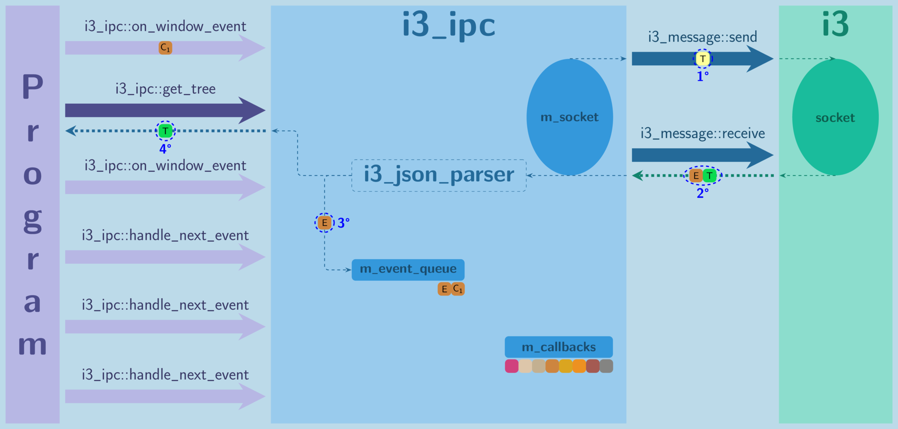
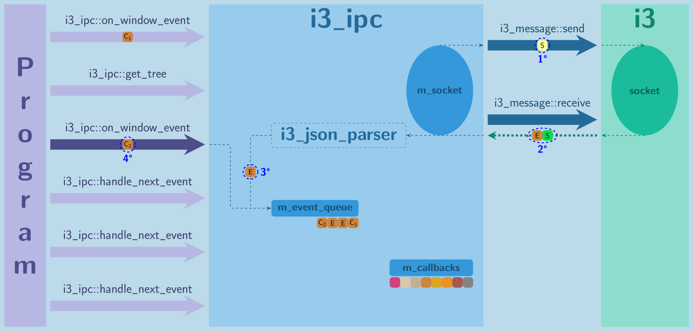
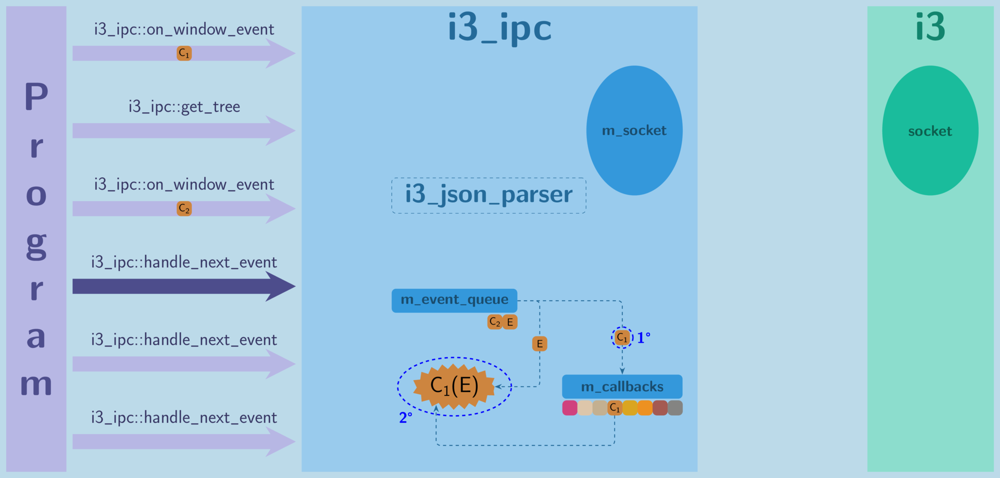
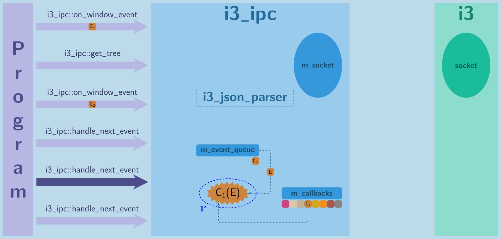
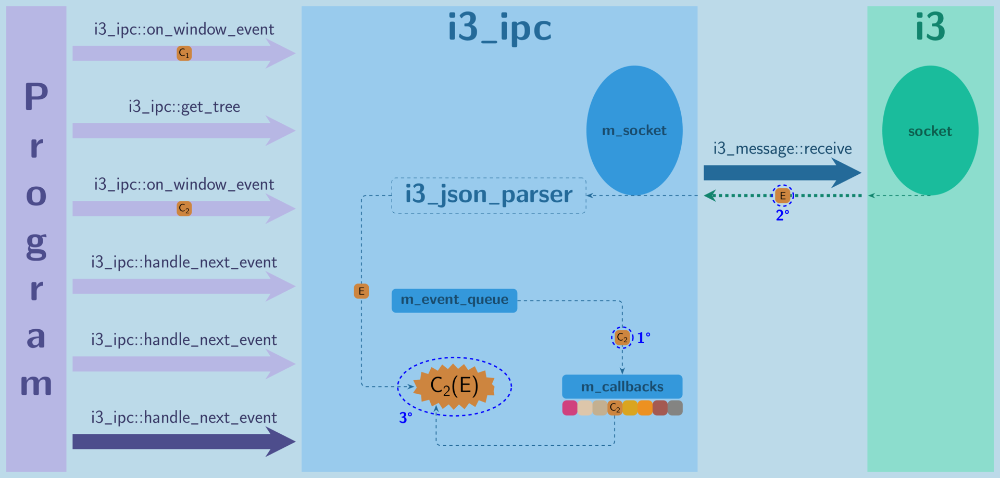

# i3-ipc++ simulator #

LaTeX project used to graphically simulate the internal work of [i3-ipc++](https://github.com/Iskustvo/i3-ipcpp) library.

## Usage ##

##### Change the project settings #####

* **NOTE**: I would recommend that you play with settings **after** you've successfully created your first simulation.

* In [settings.sty](settings.sty), you can change various options like size of generated images, size and color of objects, etc.

* For list of custom defined colors in the project, see [colors.sty](colors.sty).

##### Define the scenario which you want to simulate #####

* In [example.tex](example.tex), define which **i3-ipc++** API functions are being called and when events from **i3** are happening.

* For list of all supported **i3-ipc++** API functions and **i3** events, see the section **LATEX 2 API** in [simulator.cls](simulator.cls).

* ###### Example ######

    ```latex
    \simulate
    {
        \onWindowEvent,   % Give i3-ipc++ library new callback to use for "window" events and subscribe for them to i3.
        \windowEvent,     % Simulate happening of "window" event on i3's side.
        \getTree,         % Request "tree" data from i3-ipc++ which will get it from i3.
        \windowEvent,     % Simulate happening of "window" event on i3's side.
        \onWindowEvent,   % Give i3-ipc++ library new callback to use for "window" events and subscribe for them to i3.
        \handleNextEvent, % Handle next event that happened or will happen. This works only on subscribed events.
        \handleNextEvent, % Handle next event that happened or will happen. This works only on subscribed events.
        \windowEvent,     % Simulate happening of "window" event on i3's side.
        \handleNextEvent  % Handle next event that happened or will happen. This works only on subscribed events.
    }
    ```

##### Generate images #####

* Configure the build system in root directory of [i3-ipc++](https://github.com/Iskustvo/i3-ipcpp) project and generate the images.
    ```sh
    ./configure --help    # See how you can configure build system.
    ./configure [options] # Configure build for your needs.
    make simulation       # Generate simulation images.
    ```
* Depending on your build configuration and [settings](#change-the-project-settings), simulation images are being generated.
    * Default build directory is `build/docs/simulation/`.
    * Default image names are `step_0.png`, `step_1.png`, etc. Number of images depends on the [simulation](#define-the-scenario-which-you-want-to-simulate).

* Generated images for specified [example](#example):
    
    
    
    
    
    
